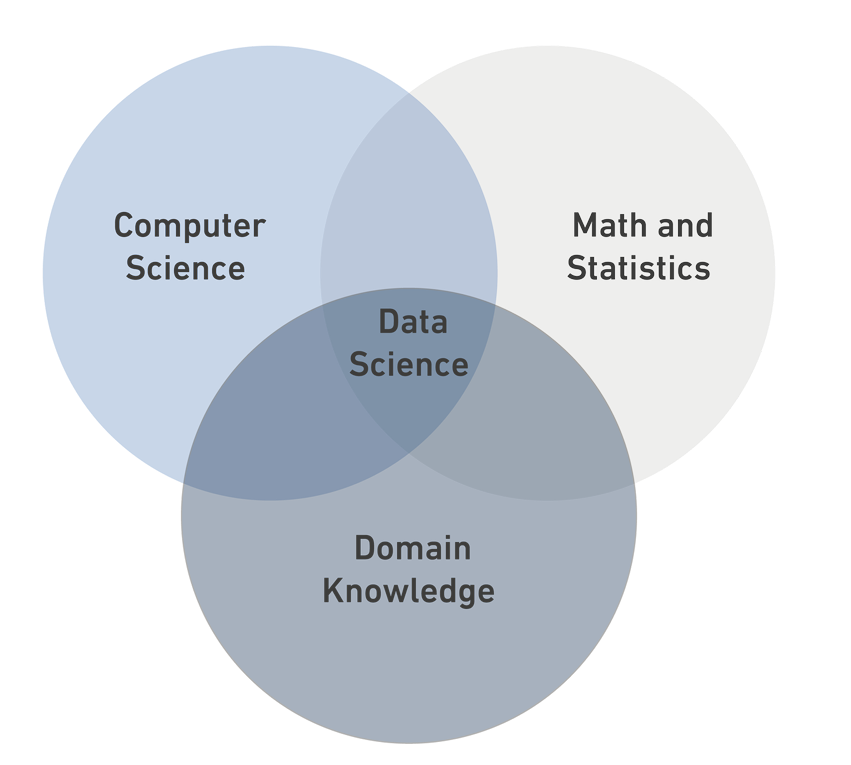

# Data Science 
## What is Data Science?
**Data Science** *is an interdisciplinary field that extracts insights from various types of data using statistics, computing, and algorithms.*




### Data Types:
- Structured Data
- Semi-Structured Data
- Unstructured Data


| Structured Data| Semi-Structured Data| Unstructured Data |
| ----------- | ----------- |  ----------- |
| organized and follows a predefined format, making it easy to search, analyze, and store| lacks a strict schema but has some organization, often in the form of tags or keys associated with the data| lacks a predefined data model and organization, making it challenging to analyze using traditional methods. It includes text-heavy content like emails, social media posts, and images.|
| e.g: tables| e.g: xml|  e.g: photos|
```python 
print("DS Bootcamp")
```
[Read More](https://en.wikipedia.org/wiki/Data_science)


